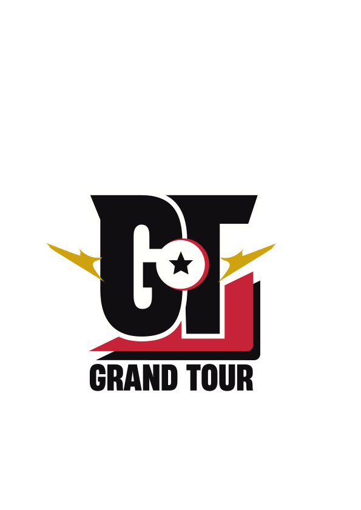

<div align="center">



# Grand Tour

**DBSCG EU Circuit tracker** — plan, track and recap your Dragon Ball Super Card Game Masters European season.


</div>

A personal-use Angular 21 SPA to follow Regional events and Finals across Europe, log results, expenses and matches, and visualise your season at a glance.

---

## Features

| Domain        | What you get                                                                |
|---------------|-----------------------------------------------------------------------------|
| **Map**       | Interactive Leaflet (CARTO dark) with Regional / Finals markers             |
| **Calendar**  | Filterable list by type, country, period, search                            |
| **My Season** | Upcoming and past events you've registered to                               |
| **Per-event** | Result (deck, leader, placement), matches (W/L/D/Bye), expenses             |
| **Budget**    | Aggregate view: totals (spent / prizes / net), category breakdown, by event |
| **Dashboard** | Bento grid: global WR, best placement, visited cities map, matchup vs deck filter, deck WR, financial recap, upcoming events |
| **Auth**      | Register / login / recovery code / per-language welcome email               |
| **i18n**      | FR / EN, including the welcome email content                                |

---

## Stack

```
Angular 21 (standalone components, signals, control flow)
Leaflet 1.9 + @types/leaflet
RxJS 7, SCSS, Vitest
json-server (dev backend, file-based persistence)
EmailJS (welcome mail)
```

---

## Quick start

You need **two terminals** running side by side.

```bash
# 1. Install deps (Windows: prefix with NODE_OPTIONS="--use-system-ca")
npm install

# 2. Terminal A — start the data backend on :3000
npm run db

# 3. Terminal B — start the Angular dev server on :4200
npm start
```

Open <http://localhost:4200>. The app probes `:3000` at boot. If it's down, a dedicated screen tells you to run `npm run db` and offers a retry button.

---

## Architecture in one diagram

```
                ┌───────────────────────────────────────────┐
                │  Angular SPA (:4200)                      │
                │                                           │
                │   features/  ── components & pages        │
                │   core/      ── services & models         │
                │   shared/    ── reusable building blocks  │
                └────────────────┬──────────────────────────┘
                                 │ HttpClient
                                 ▼
                ┌───────────────────────────────────────────┐
                │  json-server (:3000) ── db.json on disk   │
                │                                           │
                │   /users          /registrations          │
                │   /results        /expenses               │
                └───────────────────────────────────────────┘
                                 │
                                 ▼
                ┌───────────────────────────────────────────┐
                │  EmailJS  ── welcome mail (FR / EN)       │
                └───────────────────────────────────────────┘
```

- **Session** (`{userId, username}`) lives in `localStorage` so a sweep of browser cache doesn't lose your account — only your active session.
- **Password hashing** is client-side SHA-256 + per-user salt. Acceptable for localhost / dev; a real deploy would move this server-side (bcrypt).
- **All other data** lives in `json-server/db.json` so it survives CCleaner / browser resets.

---

## Design system

```
--color-bg        #110E11   night background
--color-surface   #1A171B   card surface
--color-primary   #C62338   DBSCG red
--color-accent    #CFA30F   gold accent
--color-text      #FFFFFC   off-white text
--font-display    HeadingNowTrial-57Extrabold
```

Signature visual: the **offset gold shadow** on cards mirrors the logo's offset triangle.

---

## Scripts

| Command           | What it does                              |
|-------------------|-------------------------------------------|
| `npm start`       | Angular dev server with watch on :4200    |
| `npm run db`      | json-server reading `json-server/db.json` |
| `npm run build`   | Production build into `dist/`             |
| `npm test`        | Vitest run (single pass)                  |

---

## Configuring the welcome email

EmailJS keys live in `src/app/core/config/emailjs.config.ts`. If they're empty the EmailService no-ops silently — the recovery code is still shown in-app, so users are not locked out.

The template body and subject are **pre-rendered in TypeScript** (`src/app/core/services/email.ts`) and shipped to EmailJS as plain HTML in `welcome_body`. The template on EmailJS is reduced to a single `{{{welcome_body}}}` placeholder.

---

## Roadmap status

```
Phase 1     Map + seed + design system           [DONE]
Phase 1.5   Auth + profile + recovery code       [DONE]
Phase 2     Calendar + My Season                 [DONE]
Phase 3     Event detail (result + matches +     [DONE]
            expenses)
Phase 4     Dashboard + aggregated Budget        [DONE]
Phase 5     json-server migration                [DONE]
            (CCleaner-proof persistence)
Future      Real backend (Supabase / Express)
            Image upload for deck photos
            Public season share link
```

---

## Notes

Personal hobby project. Branding asset `images/grand_tour_logo.svg` © its author.

**DBSCG** = Dragon Ball Super Card Game Masters. Not affiliated with Bandai.
